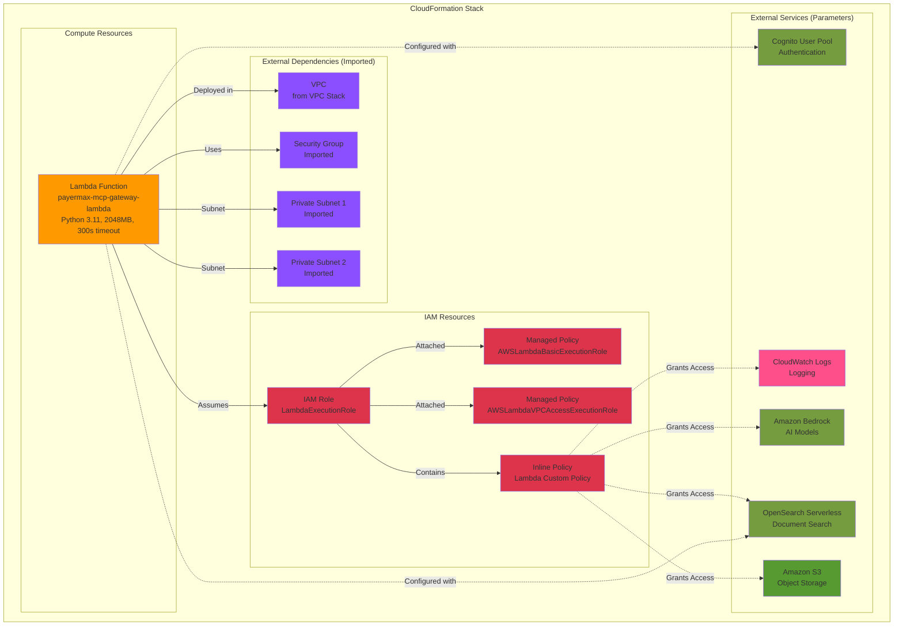

# CloudFormation Architecture Diagram

## AWS Resources Overview

## Resource Details

### 1. IAM Role (LambdaExecutionRole)
- **Type**: AWS::IAM::Role
- **Purpose**: Execution role for Lambda function
- **Managed Policies**:
  - `AWSLambdaBasicExecutionRole` - Basic Lambda execution permissions
  - `AWSLambdaVPCAccessExecutionRole` - VPC network interface management
- **Inline Policy Permissions**:
  - CloudWatch Logs: Create log groups, streams, and put log events
  - Bedrock: Invoke AI models and inference profiles
  - OpenSearch: Full API access (aoss:APIAccessAll)
  - S3: Get objects and list buckets

### 2. Lambda Function
- **Type**: AWS::Lambda::Function
- **Name**: `{GatewayName}-lambda` (default: payermax-mcp-gateway-lambda)
- **Runtime**: Python 3.11
- **Handler**: index.handler
- **Timeout**: 300 seconds (5 minutes)
- **Memory**: 2048 MB
- **Package Type**: Zip
- **VPC Configuration**:
  - Deployed in private subnets (imported from VPC stack)
  - Uses security group from VPC stack
- **Environment Variables**:
  - `CUSTOM_REGION`: AWS region
  - `COGNITO_USER_POOL_ID`: Cognito authentication
  - `COGNITO_CLIENT_ID`: Cognito client ID
  - `OPENSEARCH_ENDPOINT`: OpenSearch endpoint
  - `OPENSEARCH_INDEX`: Index name (default: payermax-docs)

### 3. Imported Resources (from VPC Stack)
- **Security Group**: `{VpcName}-SecurityGroup-ID`
- **Private Subnet 1**: `{VpcName}-PrivateSubnet1-ID`
- **Private Subnet 2**: `{VpcName}-PrivateSubnet2-ID`

### 4. External Service Integrations
- **Cognito**: User authentication and authorization
- **OpenSearch Serverless**: Document search and retrieval
- **Amazon Bedrock**: AI model inference
- **Amazon S3**: Object storage access
- **CloudWatch Logs**: Application logging

## Stack Parameters

| Parameter | Default | Description |
|-----------|---------|-------------|
| VpcName | payermax-mcp | VPC stack name prefix |
| GatewayName | payermax-mcp-gateway | Gateway name (lowercase) |
| CognitoUserPoolId | (empty) | Cognito User Pool ID |
| CognitoClientId | (empty) | Cognito Client ID |
| OpenSearchEndpoint | (empty) | OpenSearch endpoint URL |
| OpenSearchIndexName | payermax-docs | OpenSearch index name |

## Stack Outputs

| Output | Description | Export Name |
|--------|-------------|-------------|
| LambdaFunctionArn | Lambda function ARN | `{StackName}-LambdaArn` |
| LambdaFunctionName | Lambda function name | `{StackName}-LambdaName` |
| LambdaExecutionRoleArn | IAM role ARN | `{StackName}-LambdaExecutionRoleArn` |

## Dependencies

This stack requires:
1. **VPC Stack** to be deployed first (exports security group and subnet IDs)
2. **Cognito User Pool** to be created
3. **OpenSearch Serverless Collection** to be provisioned

## Security Considerations

- Lambda runs in private subnets (no direct internet access)
- IAM role follows least privilege principle
- Bedrock access limited to foundation models and inference profiles
- OpenSearch access via IAM-based authentication
- CloudWatch logging enabled for audit trail
